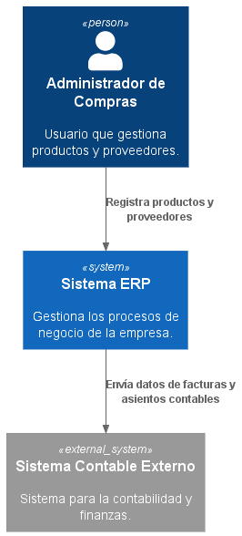

# 3. Alcance y Contexto del Sistema

## 3.1 Alcance del Sistema

El sistema ERP tiene como propósito centralizar la gestión de los procesos empresariales mediante módulos funcionales que permitan administrar las operaciones de la organización de forma integrada.

En esta primera iteración se desarrolla el **Módulo de Compras**, el cual abarca la gestión de entregas y despachos, la actualización automática del inventario, el registro de auditoría, la gestión de errores y la visualización de indicadores mediante un dashboard.

El módulo interactúa con diferentes actores del negocio y con otros módulos del ERP, permitiendo mantener la consistencia de la información durante el proceso de abastecimiento.

---

## 3.2 Contexto del Sistema

El siguiente diagrama representa el contexto del sistema (C1), mostrando los principales usuarios y sistemas externos que interactúan con el ERP, así como los límites del sistema respecto a su entorno.

