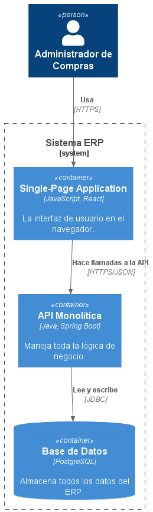

# 5. Vista de Bloques de Construcción

## 5.1 Diagrama de Contenedores (C2)

El siguiente diagrama presenta la arquitectura de alto nivel del sistema ERP, identificando los principales contenedores que lo conforman y las relaciones entre ellos. Cada contenedor cumple una responsabilidad específica dentro de la solución y se comunica mediante interfaces bien definidas.

---

## 5.2 Descripción de los Contenedores

### Frontend Web (Angular)

Aplicación web desarrollada como una **Single Page Application (SPA)** utilizando Angular. Es la interfaz mediante la cual los usuarios interactúan con el sistema ERP, permitiendo gestionar las funcionalidades del Módulo de Compras, visualizar información y realizar consultas. La comunicación con el backend se realiza mediante servicios REST sobre HTTPS.

---

### Backend (.NET 8 - ASP.NET Core Web API)

API REST desarrollada con ASP.NET Core que implementa la lógica de negocio del ERP. Es responsable de procesar las solicitudes provenientes del frontend, aplicar las reglas de negocio, validar la información, gestionar la seguridad y coordinar el acceso a la base de datos.

Entre sus principales responsabilidades se encuentran:

- Gestión de entregas y despachos.
- Actualización del inventario.
- Gestión de errores.
- Registro de auditoría.
- Exposición de servicios para el dashboard.
- Integración futura con otros módulos del ERP.

---

### Base de Datos (PostgreSQL)

Sistema gestor de bases de datos relacional encargado del almacenamiento persistente de la información del ERP.

Almacena los datos correspondientes a:

- Productos.
- Inventario.
- Compras.
- Entregas y despachos.
- Usuarios.
- Registros de auditoría.
- Configuración del sistema.

PostgreSQL fue seleccionado por su estabilidad, rendimiento, soporte para transacciones ACID y facilidad de despliegue en entornos locales y en la nube, siendo una alternativa adecuada para un Producto Mínimo Viable (MVP).

---

## 5.3 Comunicación entre Contenedores

La interacción entre los contenedores sigue el siguiente flujo:

1. El usuario interactúa con la aplicación web desarrollada en Angular.
2. Angular consume los servicios REST expuestos por la API desarrollada en ASP.NET Core.
3. El backend procesa la lógica de negocio y realiza las operaciones necesarias sobre PostgreSQL.
4. La base de datos devuelve la información solicitada al backend.
5. El backend responde al frontend, el cual presenta los resultados al usuario.