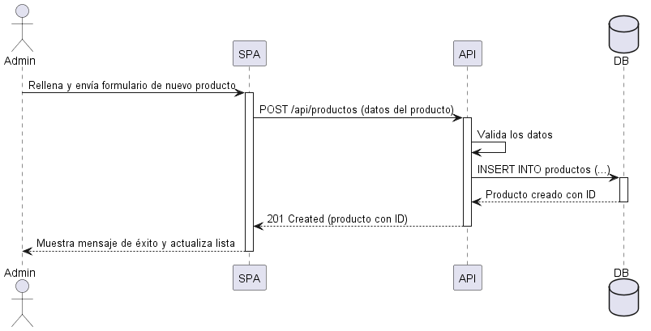

# 6. Vista de Ejecución (Runtime View)

## 6.1 Escenario: Registrar una Entrega de Mercancía

Uno de los procesos críticos del Módulo de Compras consiste en registrar la recepción de mercancía proveniente de un proveedor. Durante este proceso, el sistema valida la información recibida, almacena el movimiento de compra, actualiza el inventario y registra la operación en el historial de auditoría.

El siguiente diagrama de secuencia ilustra la interacción entre los diferentes componentes del sistema durante este proceso.

---

## 6.2 Flujo de Ejecución

1. El encargado de compras registra la información de la entrega desde la aplicación web.
2. El frontend envía la solicitud al backend mediante una petición HTTP al servicio REST.
3. El backend valida los datos recibidos y verifica que la información sea consistente.
4. Si la validación es exitosa, se registra la entrega en la base de datos.
5. El sistema actualiza automáticamente las existencias del inventario con los productos recibidos.
6. Se registra un evento en el sistema de auditoría con la información de la operación realizada.
7. El backend responde con una confirmación al frontend.
8. Finalmente, la aplicación informa al usuario que la entrega fue registrada correctamente.